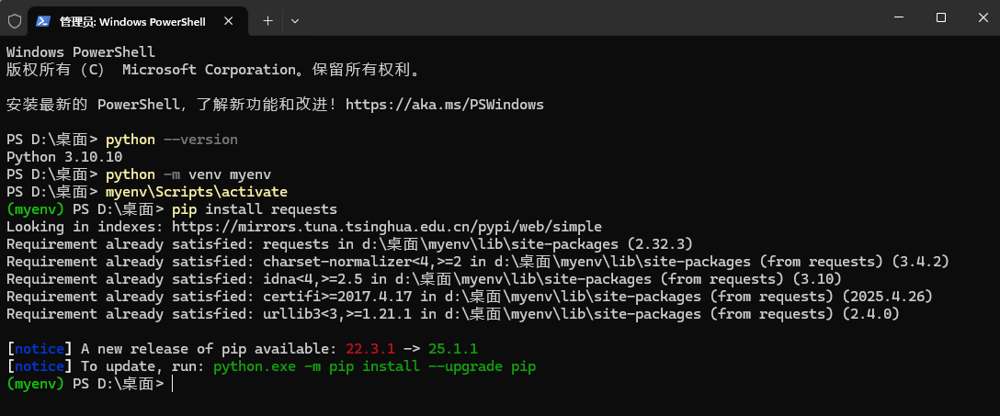

# 6.9 Day1

Created: 2025年6月10日 02:22

## Python 基础

1. **环境准备**：

介绍了如何检查Python版本、创建和激活虚拟环境以及安装第三方库。

```python
# 检查Python版本
python --version

# 创建虚拟环境
python -m venv myenv
# 激活Windows虚拟环境
myenv\Scripts\activate

# 安装第三方库
pip install requests
```



1. **变量、变量类型、作用域**：

讲解了基本的数据类型，如`int`、`float`、`str`、`list`等，以及变量的作用域和类型转换。

```
# 变量类型
name = "Alice"  # str
age = 20        # int
grades = [90, 85, 88]  # list
info = {"name": "Alice", "age": 20}  # dict

# 类型转换
age_str = str(age)
number = int("123")

# 作用域
x = 10  # 全局变量
def my_function():
    y = 5  # 局部变量
    global x
    x += 1
    print(f"Inside function: x={x}, y={y}")

my_function()
print(f"Outside function: x={x}")
```


1. **运算符及表达式**：

包括算术运算符、比较运算符、逻辑运算符和位运算符。

```
# 算术运算
a = 10
b = 3
print(a + b)  # 13
print(a // b)  # 3（整除）
print(a ** b)  # 1000（幂）

# 逻辑运算
x = True
y = False
print(x and y)  # False
print(x or y)  # True

# 比较运算
print(a > b)  # True
```


1. **语句**：

介绍了条件语句、循环语句（`for`、`while`）和异常处理。

```
# 条件语句
score = 85
if score >= 90:
    print("A")
elif score >= 60:
    print("Pass")
else:
    print("Fail")

# 循环语句
for i in range(5):
    if i == 3:
        continue
    print(i)

# 异常处理
try:
    num = int(input("Enter a number: "))
    print(100 / num)
except ZeroDivisionError:
    print("Cannot divide by zero!")
except ValueError:
    print("Invalid input!")
finally:
    print("Execution completed.")
```


1. **函数**：

包括函数的定义、参数、匿名函数、高阶函数。

```
# 函数定义
def greet(name, greeting="Hello"):
    return f"{greeting}, {name}!"

print(greet("Alice"))  # Hello, Alice!
print(greet("Bob", "Hi"))  # Hi, Bob!

# 可变参数
def sum_numbers(*args):
    return sum(args)
print(sum_numbers(1, 2, 3, 4))  # 10

# 匿名函数
double = lambda x: x * 2
print(double(5))  # 10

# 高阶函数
def apply_func(func, value):
    return func(value)
print(apply_func(lambda x: x ** 2, 4))  # 16
```


1. **包和模块**：

解释了如何定义模块、导入模块、创建包以及使用第三方模块。

```
# 创建模块 mymodule.py
# mymodule.py
def say_hello():
    return "Hello from module!"

# 主程序
import mymodule
print(mymodule.say_hello())

# 导入第三方模块
import requests
response = requests.get("https://api.github.com")
print(response.status_code)  # 200

# 包使用示例
from mypackage import mymodule
```

1. **类和对象**：

介绍了如何定义类、属性和方法，以及继承、多态和封装的概念，并展示了实例化对象的示例。

```
# 定义类
class Student:
    def __init__(self, name, age):
        self.name = name
        self.age = age

    def introduce(self):
        return f"I am {self.name}, {self.age} years old."

# 继承
class GradStudent(Student):
    def __init__(self, name, age, major):
        super().__init__(name, age)
        self.major = major

    def introduce(self):
        return f"I am {self.name}, a {self.major} student."

# 使用
student = Student("Alice", 20)
grad = GradStudent("Bob", 22, "CS")
print(student.introduce())  # I am Alice, 20 years old.
print(grad.introduce())     # I am Bob, a CS student.
```


1. **装饰器**：

讲解了装饰器作为高阶函数的使用，包括简单的装饰器和带参数的装饰器。

```
# 简单装饰器
def my_decorator(func):
    def wrapper():
        print("Before function")
        func()
        print("After function")
    return wrapper

@my_decorator
def say_hello():
    print("Hello!")

say_hello()

# 带参数的装饰器
def repeat(n):
    def decorator(func):
        def wrapper(*args, **kwargs):
            for _ in range(n):
                func(*args, **kwargs)
        return wrapper
    return decorator

@repeat(3)
def greet(name):
    print(f"Hi, {name}!")

greet("Alice")
```


1. **文件操作**：

介绍了如何读写文本文件、使用上下文管理器以及处理CSV和JSON文件。

```
# 写文件
with open("example.txt", "w") as f:
    f.write("Hello, Python!\n")

# 读文件
with open("example.txt", "r") as f:
    content = f.read()
    print(content)

# 处理CSV
import csv
with open("data.csv", "w", newline="") as f:
    writer = csv.writer(f)
    writer.writerow(["Name", "Age"])
    writer.writerow(["Alice", 20])
```


1. git命令

```bash
# 初始化Git仓库
git init

# 添加文件到暂存区
git add .

# 提交更改
git commit -m ""

# 添加远程仓库
git remote add origin ""

# 拉取并变基
git pull --rebase origin main

# 推送到远程仓库
git push origin main

# 配置全局用户名和邮箱
git config --global user.name ""
git config --global user.email
```

1. 安装conda

12.读取遥感图像

要求：

1.哨兵2号，包含了5个rgb，近红外，短红外5个波段，
2.图片数据是范围0-10000，现在需要压缩到0-255
3.现在需要转成RGB三个通道

核心代码：

```
def shuchu(tif_file):
# 打开TIFF文件
with rasterio.open(tif_file) as src:
# 读取所有波段（假设波段顺序为B02, B03, B04, B08, B12）
bands = src.read()  # 形状为 (波段数, 高度, 宽度)，这里是 (5, height, width)
# profile = src.profile  # 获取元数据

# 分配波段（假设TIFF中的波段顺序为B02, B03, B04, B08, B12）
blue = bands[0].astype(float)   # B02 - 蓝
green = bands[1].astype(float)  # B03 - 绿
red = bands[2].astype(float)    # B04 - 红
nir = bands[3].astype(float)    # B08 - 近红外
swir = bands[4].astype(float)   # B12 - 短波红外

# 真彩色正则化
rgb_orign = np.dstack((red, green, blue))
array_min, array_max = rgb_orign.min(), rgb_orign.max()
rgb_normalized = ((rgb_orign - array_min) / (array_max - array_min)) * 255
rgb_normalized = rgb_normalized.astype(np.uint8)
```