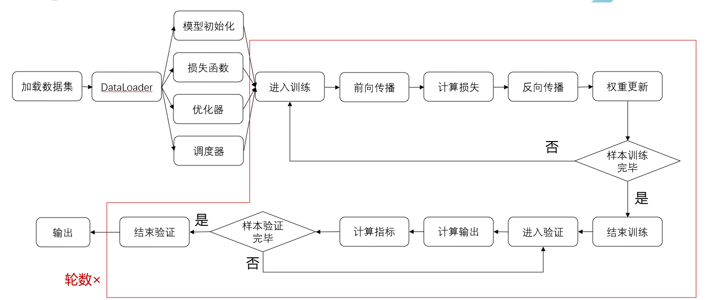

# 6.10 Day2

Created: 2025年6月10日 10:03

## 深度学习基础

#完整的深度学习训练



训练一定是两次循环

**欠拟合：**训练训练数据集表现不好，验证表现不好

**过拟合：**训练数据训练过程表现得很好，在我得验证过程表现不好

```python
imgs, targets = data  # 读取我的图片数据，以及我的标签类别
outputs = chen(imgs)  # 前向传播，得到我的输出
```


## 卷积神经网络

```jsx
import torch
import torch.nn.functional as F
input = torch.tensor([[1,2,0,3,1],
                      [0,1,2,3,1],
                      [1,2,1,0,0],
                      [5,2,3,1,1],
                      [2,1,0,1,1]])
kernel = torch.tensor([[1,2,1],
                       [0,1,0],
                       [2,1,0]])

# 不满足conv2d的尺寸要求
print(input.shape)
print(kernel.shape)

# 尺寸变换
input = torch.reshape(input,(1,1,5,5))
kernel = torch.reshape(kernel,(1,1,3,3))
print(input.shape)
print(kernel.shape)

output = F.conv2d(input=input,weight=kernel,stride=1)
print(output)

output2 = F.conv2d(input=input,weight=kernel,stride=2)
print(output2)

# padding 在周围扩展一个像素，默认为0；
output3 = F.conv2d(input=input,weight=kernel,stride=1,padding=1)
print(output3)
```


## 图片卷积

```jsx
import torch
import torchvision
from torch.utils.data import DataLoader
from torch import nn
from torch.utils.tensorboard import SummaryWriter

dataset = torchvision.datasets.CIFAR10(root="./dataset_chen",
                                       train=False,
                                       transform=torchvision.transforms.ToTensor(),
                                       download=True)
dataloader = DataLoader(dataset=dataset,
                        batch_size=64)

//卷积模型
class Chen(nn.Module):
    def __init__(self):
        super().__init__()
        self.conv1 = nn.Conv2d(in_channels=3,
                               out_channels=6,
                               kernel_size=3,
                               stride=1,
                               padding=0)
 //前向传播
    def forward(self, x):
        x = self.conv1(x)
        return x

chen = Chen()
print(chen)

writer = SummaryWriter("conv_logs")
step = 0
for data in dataloader:
    imgs, targets = data
    output = chen(imgs)

    # print(imgs.shape)  # torch.Size([64, 3, 32, 32])
    # print(output.shape)  # torch.Size([64, 6, 30, 30])
    writer.add_images("input", imgs, step)

    # torch.Size([64, 6, 30, 30]) ->([**, 3, 30, 30])
    output = torch.reshape(output, (-1, 3, 30, 30))  # -1:会根据后面的值进行调整
    writer.add_images("output", output, step)
    step += 1

```


使用tensorboard

```jsx
//tensorboard命令打开
tensorboard --logdir=conv_logs
```


最大池化层

```jsx
import torch
import torchvision
from torch import nn
from torch.nn import MaxPool2d
from torch.utils.data import DataLoader
from torch.utils.tensorboard import SummaryWriter
#
dataset = torchvision.datasets.CIFAR10(root="./dataset_chen",
                                       train=False,
                                       transform=torchvision.transforms.ToTensor(),
                                       download=True)
dataloader = DataLoader(dataset=dataset,
                        batch_size=64)

# # 最大池化没法对long整形进行池化
# input = torch.tensor([[1,2,0,3,1],
#                       [0,1,2,3,1],
#                       [1,2,1,0,0],
#                       [5,2,3,1,1],
#                       [2,1,0,1,1]], dtype = torch.float)
# input =torch.reshape(input,(-1,1,5,5))
# print(input.shape)

class Chen(nn.Module):
    def __init__(self):
        super().__init__()
        self.maxpool_1 = MaxPool2d(kernel_size=3,
                                   ceil_mode=False)
    def forward(self,input):
        output = self.maxpool_1(input)
        return output

chen = Chen()

writer = SummaryWriter("maxpool_logs")
step = 0
for data in dataloader:
    imgs, targets = data
    writer.add_images("input",imgs,step)
    output = chen(imgs)
    writer.add_images("ouput",output,step)
    step += 1
writer.close()

#
# output = chen(input)
# print(output)
```


## 作业：搭建alexnet


```jsx
import torch
from torch import nn

# 定义一个名为 alex 的类，继承自 nn.Module，用于构建神经网络模型
class alex(nn.Module):
    def __init__(self, num_class=10):
        super(alex, self).__init__()
        # 初始化模型的各个层，使用 Sequential 容器来组织这些层
        self.model = nn.Sequential(
            # 第一层卷积，输入通道数为3（RGB图像），输出通道数为48，卷积核大小为5，步长为4
            nn.Conv2d(3, 48, kernel_size=5, stride=4),
            # 第一层池化，使用最大池化，池化窗口大小为3，步长为2
            nn.MaxPool2d(kernel_size=3, stride=2),
            # 第二层卷积，输入通道数为48，输出通道数为128，卷积核大小为3
            nn.Conv2d(48, 128, kernel_size=3),
            # 第二层池化，使用最大池化，池化窗口大小为2
            nn.MaxPool2d(kernel_size=2),
            # 第三层卷积，输入通道数为128，输出通道数为192，卷积核大小为3
            nn.Conv2d(128, 192, kernel_size=3),
            # 第四层卷积，输入通道数为192，输出通道数为192，卷积核大小为3
            nn.Conv2d(192, 192, kernel_size=3),
            # 第五层卷积，输入通道数为192，输出通道数为128，卷积核大小为3
            nn.Conv2d(192, 128, kernel_size=3),
            # 第三层池化，使用最大池化，池化窗口大小为2
            nn.MaxPool2d(kernel_size=2),
            # 将多维的卷积层输出展平成一维，以便输入到全连接层
            nn.Flatten(),
            # 第一层全连接，输入特征数为128*3*3（根据前面的卷积和池化层计算得出），输出特征数为2048
            nn.Linear(128 * 3 * 3, 2048),
            # 第二层全连接，输入特征数为2048，输出特征数为1024
            nn.Linear(2048, 1024),
            # 第三层全连接，输入特征数为1024，输出特征数为分类类别数（num_class）
            nn.Linear(1024, num_class),
        )

        # 定义分类器部分，使用 Sequential 容器来组织这些层
        self.classifier = nn.Sequential(
            # Dropout层，用于防止过拟合，丢弃率为0.5
            nn.Dropout(p=0.5),
            # 第一层全连接，输入特征数为256*6*6（根据前面的卷积和池化层计算得出），输出特征数为4096
            nn.Linear(256 * 6 * 6, 4096),
            # ReLU激活函数
            nn.ReLU(inplace=True),
            # 再次使用Dropout层，丢弃率为0.5
            nn.Dropout(p=0.5),
            # 第二层全连接，输入特征数为4096，输出特征数为4096
            nn.Linear(4096, 4096),
            # ReLU激活函数
            nn.ReLU(inplace=True),
            # 第三层全连接，输入特征数为4096，输出特征数为分类类别数（num_class）
            nn.Linear(4096, num_class),
        )

    def forward(self, x):
        # 前向传播函数，定义了数据如何通过网络
        y = self.model(x)
        # 这里注释掉了一些代码，可能是为了调试或测试不同网络结构
        # y = F.interpolate(
        #     x,
        #     size=(224, 224),
        #     mode='bilinear',
        #     align_corners=False
        # )
        # y = self.features(y)
        # y = torch.flatten(y, 1)
        # y = self.classifier(y)

        return y

if __name__ == '__main__':
    # 创建一个随机输入张量，模拟一个批次的图像数据，批次大小为1，图像尺寸为3x224x224
    x = torch.randn(1, 3, 224, 224)
    # 实例化模型
    alexnet = alex()
    # 将输入数据通过网络，得到输出
    y = alexnet(x)
    # 打印输出的形状，以验证网络结构是否正确
    print(y.shape)

    # 不同输入尺寸的网络输出
    # model = alex()
    # x = torch.randm(1, 3, 32, 32)
    # y = model(x)
    # print(y.shape)

```


train.py