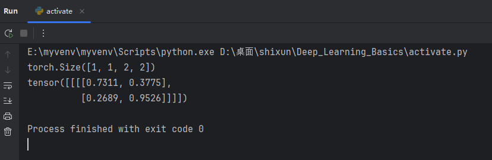

# 6.11 Day3

Created: 2025年6月15日 10:15

# 深度学习

### 激活函数

常见激活函数的优缺点

---

### 1. **Sigmoid**

**优点：**

① 输出值在 (0,1)，具有概率意义，适合二分类输出层

② 函数平滑可微，便于梯度计算

**缺点：**

① 梯度消失严重（饱和区梯度趋近于0）

② 输出非零中心化，降低训练效率

③ 指数计算开销较大

---

### 2. **Tanh**

**优点：**

① 输出零中心化 (-1,1)，收敛快于 Sigmoid

② 平滑可微，适合 RNN/LSTM 隐藏层

**缺点：**

① 梯度消失问题依然存在

② 指数计算开销大

---

### 3. **ReLU**

**优点：**

① 计算极快（无指数运算）

② 正区间梯度恒为1，缓解梯度消失

③ 稀疏激活性提升模型效率

**缺点：**

① 死亡 ReLU 问题（负输入导致永久失活）

② 输出非零中心化

---

### 4. **Leaky ReLU**

**优点：**

① 保留 ReLU 计算高效性

② 负区间梯度为 α，解决死亡 ReLU 问题

**缺点：**

① 需手动设置超参数 α（通常 0.01）

② 输出非零中心化

---

### 5. **ELU**

**优点：**

① 负区间平滑输出，接近零中心化

② 缓解死亡 ReLU 问题

③ 对噪声更鲁棒

**缺点：**

① 负区间含指数运算，计算开销大

② 需选择参数 α（通常设为 1）

---

### 6. **Softmax**

**优点：**

① 输出为概率分布（多分类唯一选择）

② 概率解释清晰直观

**缺点：**

① 仅适用于输出层

② 指数计算开销大

③ 需数值稳定处理防溢出

---

### 7. **Swish**

**优点：**

① 实验性能常优于 ReLU（谷歌验证）

② 平滑非单调性增强表达能力

③ 缓解梯度消失

**缺点：**

① 含 Sigmoid 计算，速度慢于 ReLU

② 较新，实践验证少于经典函数

---

### 激活函数

```jsx
import torch
import torchvision
from torch.utils.data import DataLoader
from torch.utils.tensorboard import SummaryWriter

# 导入数据集
dataset = torchvision.datasets.CIFAR10(root="dataset_chen",
                                       train=False,
                                       transform=torchvision.transforms.ToTensor())
dataloader = DataLoader(dataset=dataset,
                        batch_size=64)

# 设置input
input = torch.tensor([[1, -0.5],
                      [-1, 3]])
input = torch.reshape(input, (-1, 1, 2, 2))
print(input.shape)

# 非线性激活网络
class Chen(torch.nn.Module):
    def __init__(self):
        super().__init__()
        self.relu = torch.nn.ReLU()
        self.sigmoid = torch.nn.Sigmoid()

    def forward(self, input):
        output = self.sigmoid(input)
        return output

chen = Chen()

writer = SummaryWriter("sigmod_logs")
step = 0
for data in dataloader:
    imgs, targets = data
    writer.add_images("input", imgs, global_step=step)
    output_sigmod = chen(imgs)
    writer.add_images("output", output_sigmod, global_step=step)
    step += 1
writer.close()

output = chen(input)
print(output)

```



训练网络模型


# 训练自己的数据集

1 数据集预处理，新建工程项目

```jsx
import os
import shutil
from sklearn.model_selection import train_test_split
import random

# 设置随机种子以确保可重复性
random.seed(42)

# 数据集路径
dataset_dir = r'D:\桌面\shixun\dataset\Images'  # 替换为你的数据集路径
train_dir = r'D:\桌面\shixun\dataset\image2\train'  # 训练集输出路径
val_dir = r'D:\桌面\shixun\dataset\image2\val'  # 验证集输出路径

# 划分比例
train_ratio = 0.7

# 创建训练集和验证集目录
os.makedirs(train_dir, exist_ok=True)
os.makedirs(val_dir, exist_ok=True)

# 遍历每个类别文件夹
for class_name in os.listdir(dataset_dir):
    if class_name not in ["train","val"]:
        class_path = os.path.join(dataset_dir, class_name)

        # 获取该类别下的所有图片
        images = [f for f in os.listdir(class_path) if f.endswith(('.jpg', '.jpeg', '.png'))]
        # 确保图片路径包含类别文件夹
        images = [os.path.join(class_name, img) for img in images]

        # 划分训练集和验证集
        train_images, val_images = train_test_split(images, train_size=train_ratio, random_state=42)

        # 创建类别子文件夹
        os.makedirs(os.path.join(train_dir, class_name), exist_ok=True)
        os.makedirs(os.path.join(val_dir, class_name), exist_ok=True)

        # 复制训练集图片
        for img in train_images:
            src = os.path.join(dataset_dir, img)
            dst = os.path.join(train_dir, img)
            shutil.move(src, dst)

        # 复制验证集图片
        for img in val_images:
            src = os.path.join(dataset_dir, img)
            dst = os.path.join(val_dir, img)
            shutil.move(src, dst)

        shutil.rmtree(class_path)
```


```jsx
### prepare.py

import os

# 创建保存路径的函数
def create_txt_file(root_dir, txt_filename):
    # 打开并写入文件
    with open(txt_filename, 'w') as f:
        # 遍历每个类别文件夹
        for label, category in enumerate(os.listdir(root_dir)):
            category_path = os.path.join(root_dir, category)
            if os.path.isdir(category_path):
                # 遍历该类别文件夹中的所有图片
                for img_name in os.listdir(category_path):
                    img_path = os.path.join(category_path, img_name)
                    f.write(f"{img_path} {label}\n")

create_txt_file(r'D:\Desktop\tcl\dataset\image2\train', 'train.txt')
create_txt_file(r'D:\Desktop\tcl\dataset\image2\val', "val.txt")
```


最后得到train.txt和val.txt


## 加载数据集

```jsx
import os
from torch.utils import data
from PIL import Image

class ImageTxtDataset(data.Dataset):
    def __init__(self, txt_path: str, folder_name, transform):
        self.transform = transform
        self.data_dir = os.path.dirname(txt_path)
        self.imgs_path = []
        self.labels = []
        self.folder_name = folder_name
        with open(txt_path, 'r') as f:
            lines = f.readlines()
        for line in lines:
            img_path, label = line.split()
            label = int(label.strip())
            # img_path = os.path.join(self.data_dir, self.folder_name, img_path)
            self.labels.append(label)
            self.imgs_path.append(img_path)

    def __len__(self):
        return len(self.imgs_path)

    def __getitem__(self, i):
        path, label = self.imgs_path[i], self.labels[i]
        image = Image.open(path).convert("RGB")
        if self.transform is not None:
            image = self.transform(image)
        return image, label
```


修改路径，数据增强

```jsx
train_data = ImageTxtDataset(r"D:\桌面\shixun\dataset\train.txt",
                             r"D:\桌面\shixun\dataset\image2\train",
                             #数据增强
                             transforms.Compose([transforms.Resize(256),
                                                 transforms.RandomHorizontalFlip(),
                                                 transforms.ToTensor(),
                                                 transforms.Normalize(mean=[0.485, 0.456, 0.406],
                                                                      std=[0.229, 0.224, 0.225])
                                                 ])
                             )
```


