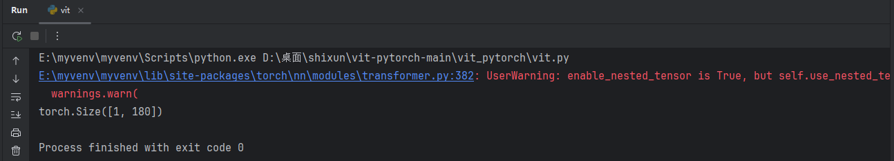
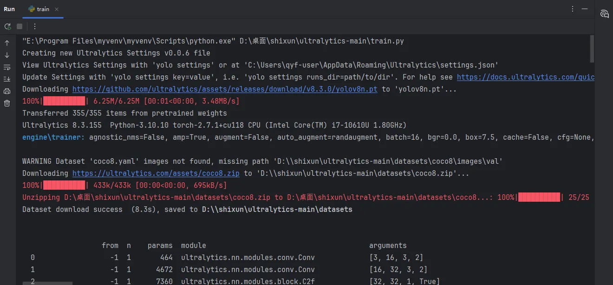
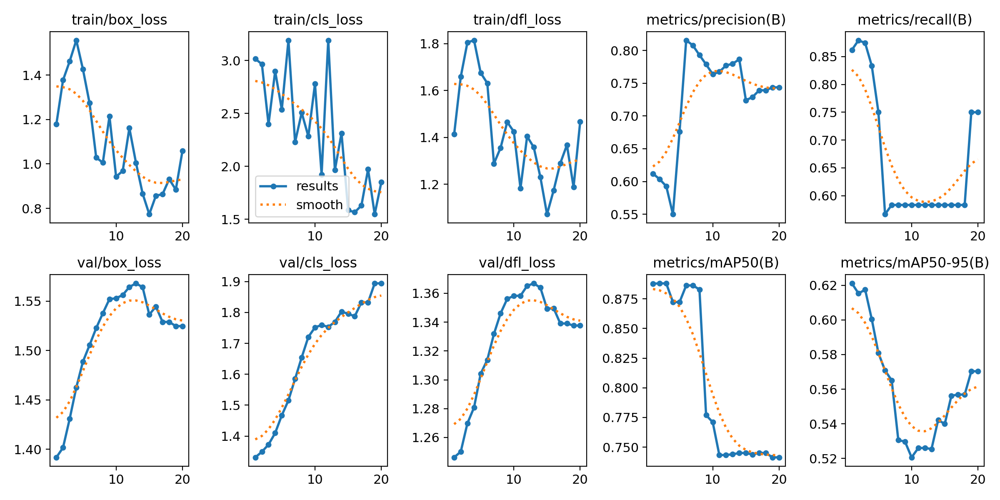
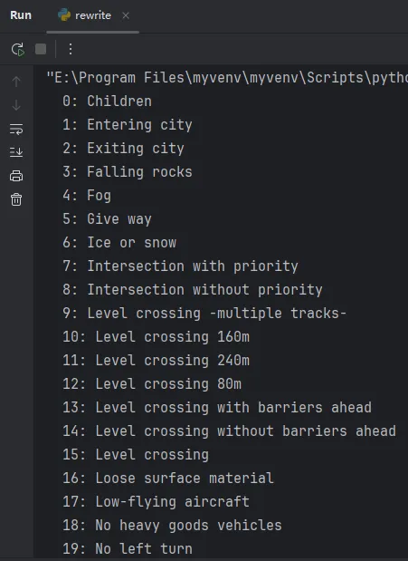
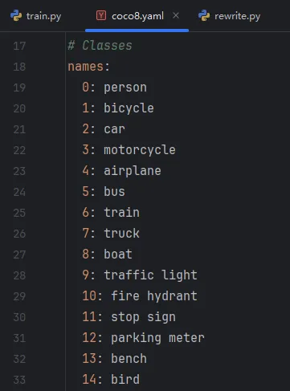
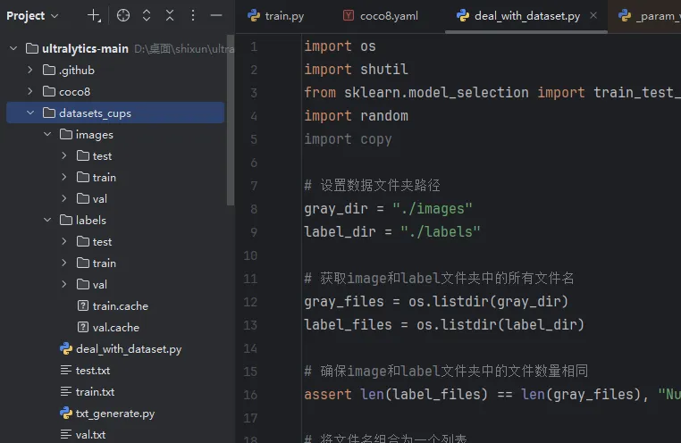

# 6.12 Day4

Created: 2025年6月15日 17:07

# transormer

```jsx
if __name__ == '__main__':
    device = torch.device('cuda' if torch.cuda.is_available() else 'cpu')
    v = v1I(image_size=256,
            patch_size=16,
            num_classes=180,
            dim=1024,
            depth=6,
            heads=16,
            mUp_dim=2048,
            dropout=0.1,
            emb_dropout=0.1)
    v.to(device)
    img = torch.randn(1, 3, 256, 256).to(device)
    # summary(v, (3, 256, 256))
    preds = v(img)
    print(preds.shape)  # 输出: torch.Size([1, 180])
```



### 重要的参数设置


# yolo训练自己的数据集

## 训练预加载数据集

选择yolo模型的训练文件

```jsx
from ultralytics import YOLO

if __name__ == '__main__':

    model = YOLO("yolov8n.yaml").load("yolov8n.pt")
    model.train(data = "coco8.yaml",imgsz=640,epochs=20,batch=16)

```




运行好之后，得到runs文件，里面有很多图片


重点看results.png的图片presion精度：预测正确的框的个数和预测所有的框的比值



recall召回率：预测的框个数和我们标签框个数的比值

iou交并比：预测的框和我们真实的框 交集和并集的面积之比

map50：交并比在0.5的所有框的精度的平均值，用来评价模型的预测的综合能力

map50-95：是用来评估模型精准预测的能力


## 训练自己的数据集

交通标志数据集的目录结构


打开我们的TranfficSignDetection.v9.yaml 发现和我们的coco数据集的格式有区别，rewrite将yaml配置文件更改成coco数据集格式

```jsx
lst = ['Children', 'Entering city', 'Exiting city', 'Falling rocks', 'Fog', 'Give way', 'Ice or snow', 'Intersection with priority', 'Intersection without priority', 'Level crossing -multiple tracks-', 'Level crossing 160m', 'Level crossing 240m', 'Level crossing 80m', 'Level crossing with barriers ahead', 'Level crossing without barriers ahead', 'Level crossing', 'Loose surface material', 'Low-flying aircraft', 'No heavy goods vehicles', 'No left turn', 'No overtaking by heavy goods vehicles', 'No right turn', 'No vehicles carrying dangerous goods', 'No vehicles', 'One-way street', 'Opening bridge', 'Parking zone', 'Pedestrian crossing', 'Pedestrians', 'Priority over oncoming traffic', 'Right curve', 'Road narrows', 'Roadworks', 'Series of curves', 'Slippery surface', 'Soft verges', 'Steep ascent', 'Steep descent', 'Traffic queues', 'Traffic signals', 'Trams', 'Tunnel', 'Two-way traffic', 'Unprotected quayside or riverbank', 'Wild animals', 'ahead only', 'ahead or right', 'bumpy road', 'crosswalk', 'do_not_enter', 'end ofSpeed limit 70', 'general caution', 'keep right', 'left curve', 'no admittance', 'no overtakes', 'no stopping', 'no_parking', 'priority road', 'road work', 'roundabout', 'slippery road', 'speed limit -100-', 'speed limit -110-', 'speed limit -120-', 'speed limit -130-', 'speed limit -20-', 'speed limit -30-', 'speed limit -40-', 'speed limit -5-', 'speed limit -50-', 'speed limit -60-', 'speed limit -70-', 'speed limit -80-', 'speed limit -90-', 'stop', 'traffic light- green', 'traffic light- red', 'trafic light- red', 'turn left orright only', 'turn right only', 'yellow', 'yield']

for i, item in enumerate(lst):
	print(f"  {i}: {item}")
```





更改模型配置文件，类别为83


更改路径为交通标志的数据集配置文件路径


训练数据集


# 制作自己的数据集

打开miniconda终端，创建一个labelimg的环境，python版本一定是3.9


先进入labelimg的环境


新建文件夹，打标签


# 训练自己制作的数据集

划分数据集

```jsx
import os
import shutil
from sklearn.model_selection import train_test_split
import random
import copy

# 设置数据文件夹路径
gray_dir = "./images"
label_dir = "./labels"

# 获取image和label文件夹中的所有文件名
gray_files = os.listdir(gray_dir)
label_files = os.listdir(label_dir)

# 确保image和label文件夹中的文件数量相同
assert len(label_files) == len(gray_files), "Number of image and labels files must be t he same!"

# 将文件名组合为一个列表
# label_files = copy.copy(gray_files)
# for i in range(len(label_files)):
#     label_files[i] = label_files[i].replace(".jpg", ".txt")

files = list(zip(gray_files, label_files))
random.shuffle(files)

# 划分数据为训练集和测试集（这里还包括验证集，但你可以根据需要调整比例）
train_files, temp_files = train_test_split(files, test_size=0.3, random_state=42)  # 假设30%为测试集
valid_files, test_files = train_test_split(temp_files, test_size=0.5, random_state=42)  # 剩下的50%中，再取50%为验证集
print("测试集长度：" + str(len(test_files)))
print("训练集长度：" + str(len(train_files)))
print("验证集长度：" + str(len(valid_files)))

# 创建目录（如果它们不存在）
for split in ['train', 'test', 'val']:

    os.makedirs(os.path.join(gray_dir, split), exist_ok=True)
    os.makedirs(os.path.join(label_dir, split), exist_ok=True)

# 移动文件到相应的目录
def move_files(file_list, split):
    for gray, lbl in file_list:

        shutil.move(os.path.join(gray_dir, gray), os.path.join(gray_dir, split, gray))
        shutil.move(os.path.join(label_dir, lbl), os.path.join(label_dir, split, lbl))

move_files(train_files, 'train')
move_files(valid_files, 'val')
move_files(test_files, 'test')

print("Data split completed!")

```



生成数据集的train.txt val.txt test.txt

```jsx
import os
# 最后一步:生成数据集的train.txt val.txt test.txt

def write_file_paths_to_txt(directory, output_file):
    with open(output_file, 'w') as f:
        for root, dirs, files in os.walk(directory):
            for file in files:
                file_path = os.path.join(root, file)
                f.write(file_path + '\n')

            # 调用函数，为每个文件夹写入文件路径

write_file_paths_to_txt(r'D:\Desktop\ultralytics-main\datasets_cups\images\\train', 'train.txt')
write_file_paths_to_txt(r'D:\Desktop\ultralytics-main\datasets_cups\images\\test', 'test.txt')
write_file_paths_to_txt(r'D:\Desktop\ultralytics-main\datasets_cups\images\\val', 'val.txt')

```